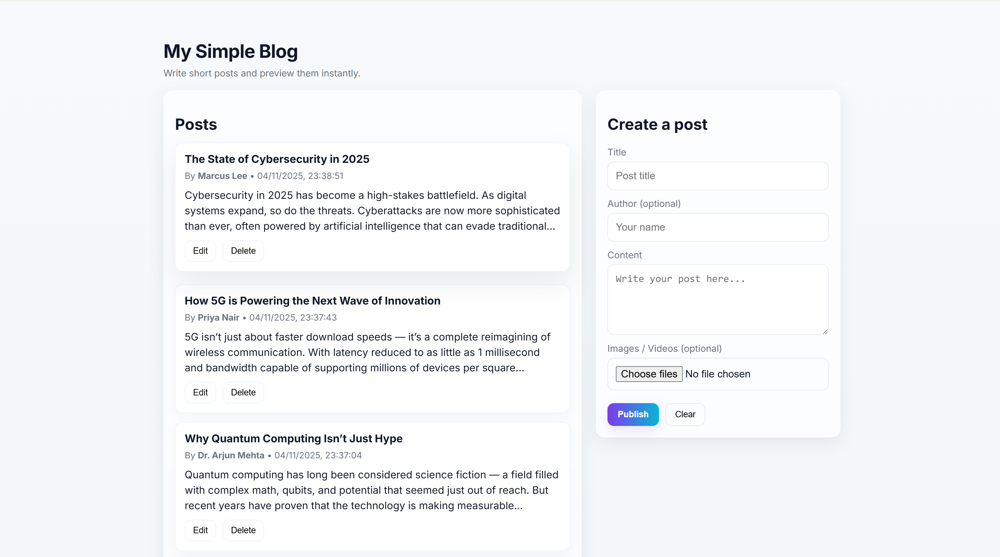

Simple Blog
===========

This is a small static+Express blog that stores posts in `data/posts.json`.

Features added:
- Create / Edit / Delete posts
- Persist posts to `data/posts.json`
- Upload images and videos (saved into `public/uploads`) via a `/upload` endpoint

Setup
-----
- Install dependencies (you need `express` already; to enable uploads run):

  npm install multer

- Start server:

  node server.js

Notes
-----
- Uploaded files are stored in `public/uploads` and served statically.
- If `multer` is not installed the server will start but `/upload` will return 500 until you install `multer`.

# my-simple-blog website

## Quick walkthrough

![] (post view.png)

